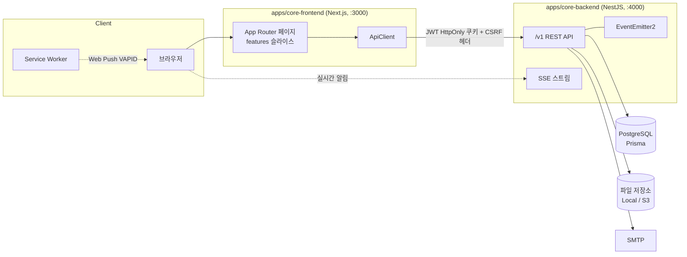
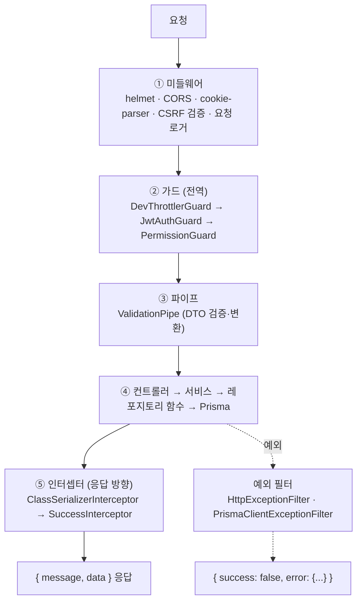

# 00. 시스템 개요

> weaver2 전체를 한 장으로 조망합니다 — 무엇이 어디에 있고, 요청 하나가 어떤 경로로 처리되는지.
> 이 장을 읽고 나면 "이 기능은 어느 디렉토리를 열어야 하지?"에 답할 수 있어야 합니다.

## 1. 큰 그림

weaver2는 pnpm 모노레포이며, 실행 단위는 두 앱입니다:



| 구성 요소 | 위치 | 역할 |
|---|---|---|
| 백엔드 | `apps/core-backend/` | NestJS REST API (`/v1` 프리픽스, 포트 4000), Swagger `/docs`(개발 환경 한정) |
| 프론트엔드 | `apps/core-frontend/` | Next.js App Router (포트 3000) |
| 공유 라이브러리 | `libs/` 6종 | 백·프론트 공용 상수(`shared`), 전역 파이프라인(`common`), 페이지네이션·업로드·이메일·Prisma 모듈 |
| DB 스키마 | `apps/core-backend/prisma/schema/` | 도메인별 멀티파일 Prisma 스키마 → [02장](02-data-model.md) |

> **정체성** (CHARTER §1): weaver2는 "범용 레코드-CRUD 기반 + 배터리" 보일러플레이트입니다. 인증·권한·알림·업로드·관리자·보안은 도메인 무관 **substrate**(항상 재사용)이고, 게시판·신고는 그 위에 얹은 **레퍼런스 예시**입니다. 이 구분이 코드 배치에도 그대로 반영되어 있습니다(§3).

## 2. 백엔드 요청 수명주기

`POST /v1/boards/:id/posts` 같은 요청 하나가 거치는 전 단계입니다. 전역 파이프라인의 조립 지점은 `apps/core-backend/src/main.ts` → `setNestApp()` ([`libs/common/src/global/nest.config.ts`](../../libs/common/src/global/nest.config.ts))입니다.



### ① 미들웨어 — `libs/common/src/global/middleware/`

- **helmet** — 보안 헤더. **CORS** — `ALLOWED_ORIGINS` env 화이트리스트(기본 `http://localhost:3000`), `credentials: true`
- **CSRF** — `csrf-csrf` double-submit 패턴. 뮤테이션 요청은 `x-csrf-token` 헤더 필수, `GET/HEAD/OPTIONS` 면제 (`security.middleware.ts`)
- **RequestLoggerMiddleware** — 전 경로 요청 로깅 (`core.module.ts`의 `configure()`에서 `forRoutes('*')`)

### ② 가드 — 전역 3종

전역 가드는 두 곳에서 `APP_GUARD`로 등록됩니다. **이 위치를 기억해두세요** — "왜 모든 라우트에 인증이 걸리지?"의 답이 여기 있습니다:

| 가드 | 등록 위치 | 역할 |
|---|---|---|
| `DevThrottlerGuard` | `apps/core-backend/src/core.module.ts` | Rate limiting (전역 60초/100회) |
| `JwtAuthGuard` | `apps/core-backend/src/core/auth/auth.module.ts` | JWT 쿠키 검증. **secure-by-default** — 모든 라우트가 기본 보호되고, 공개 라우트만 `@Public()`으로 명시 |
| `PermissionGuard` | 〃 (JwtAuthGuard 다음 순서) | `@RequirePermission()` 메타데이터가 있으면 권한 검사 → [04장](04-permissions.md) |

`@Public()`이 붙은 라우트도 `access_token` 쿠키가 있으면 검증해서 `request.user`를 채웁니다 — "로그인했으면 더 보여주는" 공개 페이지가 이 동작에 의존합니다 (`core/auth/guards/jwt-auth.guard.ts`).

### ③ 파이프 — `libs/common/src/global/pipe/`

`ValidationPipe`(`transform` + `whitelist` + `forbidNonWhitelisted`): DTO에 없는 필드는 거부됩니다. 검증 실패는 422 + `{ code: 'VALIDATION_ERROR', message: string[] }`.

### ④⑤ 핸들러와 응답 포맷

핸들러 계층 구조(Controller → Service → Repository 함수)는 [01장](01-backend.md)에서, 응답·에러 포맷의 정확한 형태도 [01장 §5](01-backend.md#5-전역-응답에러-포맷)에서 다룹니다. 요약:

- 성공: `{ "message": "...", "data": ... }` (SuccessInterceptor가 래핑)
- 에러: `{ "success": false, "error": { "code", "message", "timestamp", ... } }`

## 3. 디렉토리 지도 — "이 기능은 어디에?"

```
apps/core-backend/src/
├── core/            # substrate — auth, user, notification, permission, terms
├── features/        # 레퍼런스 도메인 — board, report, search  ← 새 도메인 기능이 들어갈 자리
├── infrastructure/  # 외부 연동 — email, upload, analytics, config(SystemSetting)
├── system/          # 운영 — admin(관리자 API), health, static
└── core.module.ts   # 루트 모듈 (관례상 AppModule 대신 CoreModule)

apps/core-frontend/src/
├── app/             # Next.js App Router 라우팅
├── features/        # 도메인별 슬라이스 (board, search, ...)
├── core/            # 인증·사용자 등 substrate 슬라이스
├── shared/          # 공통 UI (WeaverDataTable, TabComponent, ...)
├── infrastructure/  # ApiClient, Providers
└── skins/           # 스킨(테마) 시스템

libs/                # @weaver2/* alias로 import
├── shared/          # ★ 백·프론트 공용 — PERMISSIONS 상수, hasPermission()
├── common/          # 백엔드 전역 파이프라인 (미들웨어·파이프·인터셉터·필터·로거)
├── pagination/      # keyset / cursor / offset 페이지네이션
├── prisma/          # PrismaService (@Global)
├── upload/          # StorageProvider (Local/S3), 썸네일
└── email/           # Nodemailer 래퍼
```

찾기 규칙:

- **API 동작이 궁금하면** → `apps/core-backend/src/{core|features|system}/<도메인>/controllers/`에서 시작해 서비스 → 레포지토리로 내려갑니다
- **화면이 궁금하면** → `apps/core-frontend/src/app/`에서 라우트를 찾고, 실제 구현은 `features/<도메인>/` 슬라이스에 있습니다
- **백·프론트 둘 다 쓰는 값이면** → `libs/shared` (권한 상수가 대표)
- **전역 동작(모든 요청에 걸리는 것)이면** → `libs/common/src/global/`

## 4. 개발 흐름 요약

환경 구축은 [README "시작하기"](../../README.md#-시작하기)를 따르세요. 일상 루프:

```bash
pnpm dev                              # 백엔드 (watch)
cd apps/core-frontend && pnpm dev     # 프론트엔드 (별도 터미널)
pnpm db:migrate                       # 스키마 변경 시
pnpm lint && pnpm test                # 커밋 전 (pre-commit 훅이 테스트를 강제)
```

Swagger는 개발 환경에서만 http://localhost:4000/docs 에 뜹니다 (`NODE_ENV=production`이면 비활성).

## 더 보기

- 다음 장: [01. 백엔드 아키텍처](01-backend.md) — 모듈 구조와 레포지토리 패턴
- 요청 파이프라인 조립 코드: [`libs/common/src/global/nest.config.ts`](../../libs/common/src/global/nest.config.ts)
- 왜 이렇게 설계했는가: [`CHARTER.md`](../../CHARTER.md) §5 설계 원칙
