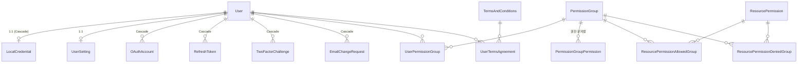
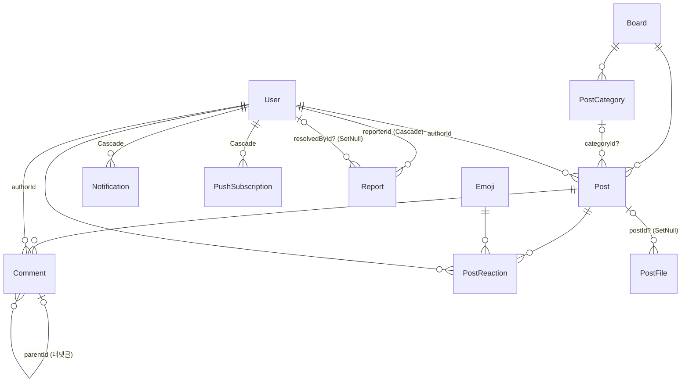

# 02. 데이터 모델

> 이 챕터는 weaver2의 Prisma 스키마 전체 지도를 다룹니다 — 어떤 모델이 어디에 정의되어 있고, 서로 어떻게 연결되며, 삭제·숨김이 어떤 정책으로 동작하는지.
> 스키마 원본: [`apps/core-backend/prisma/schema/`](../../apps/core-backend/prisma/schema/)

## 한눈에 보기

- PostgreSQL + Prisma (멀티파일 스키마) — 모델 **31개**, enum **7개**
- 모든 PK는 `String @id @default(uuid())` (예외: `SystemSetting`은 `key`가 자연키 PK)
- FK 네이밍은 `{참조모델}Id` 카멜케이스로 통일 (`userId`, `boardId`, `permissionGroupId` …)
- 삭제는 3단계로 구분: **숨김(`hiddenAt`)** → **소프트 삭제(`deletedAt`)** → **하드 삭제(명시적)**

## 1. 스키마 파일 지도

스키마는 단일 `schema.prisma`가 아니라 **도메인별 파일로 분리**되어 있습니다. Prisma CLI에는 파일 대신 폴더를 넘깁니다 — 루트 `package.json`의 `db:*` 스크립트가 전부 `--schema=apps/core-backend/prisma/schema` (폴더)를 지정합니다.

| 파일 | 모델 | enum |
|---|---|---|
| `_config.prisma` | (generator/datasource만) | — |
| `auth.prisma` | User, UserSetting, LocalCredential, TwoFactorChallenge, EmailChangeRequest, OAuthAccount, RefreshToken | — |
| `board.prisma` | Board, Post, Comment, PostCategory, Emoji, PostReaction, PostFile | PostStatus |
| `permissions.prisma` | PermissionGroup, PermissionGroupPermission, UserPermissionGroup, ResourcePermission, ResourcePermissionAllowedGroup, ResourcePermissionDeniedGroup | — |
| `notification.prisma` | Notification, PushSubscription | NotificationType |
| `report.prisma` | Report | ReportTarget, ReportReason, ReportStatus, ReportAction |
| `system.prisma` | SystemSetting, PageView, MonthlyAnalyticsReport, SecurityAuditReport | — |
| `terms.prisma` | TermsAndConditions, UserTermsAgreement | — |
| `email.prisma` | EmailTemplate, EmailLog | EmailStatus |

> **새 도메인을 추가할 때**: 새 `.prisma` 파일을 이 폴더에 만들면 됩니다. 폴더 전체가 하나의 스키마로 합쳐지므로 별도 등록 절차는 없습니다.

## 2. 도메인별 모델 해설

### 2.1 인증 (`auth.prisma`)

**User**가 전체 데이터 모델의 뿌리입니다. 인증 수단은 User 본체가 아니라 자식 테이블로 분리되어 있습니다:

- **User** — 사용자 코어. `email` / `username` / `displayName` 3중 unique. 제재 상태(`warningCount`, `suspendedUntil`)와 soft-delete(`deletedAt`)를 직접 가짐. DB 테이블명은 `@@map("users")`.
- **LocalCredential** (1:1) — 이메일/비밀번호 자격증명. 비밀번호 해시, 이메일 인증(`isVerified`, `verificationToken`), 비밀번호 재설정 토큰, TOTP 2FA(`totpEnabled`, `totpSecret`), 이메일 OTP 스위치, 로그인 잠금(`failedAttempts`, `lockedUntil`)까지 **"로컬 로그인에 관련된 모든 상태"**가 이 한 테이블에 모입니다.
- **OAuthAccount** (1:N) — 소셜 로그인 연결. `@@unique([provider, providerId])`로 같은 소셜 계정의 중복 연결 방지.
- **RefreshToken** (1:N) — 기기별 세션. `ipAddress`/`userAgent`를 기록해 "세션 관리" 화면의 데이터가 됨. soft-delete 없이 만료(`expires`) 기반.
- **TwoFactorChallenge** — 2FA 진행 중 상태(코드 해시 + 만료). **EmailChangeRequest** — 이메일 변경 인증 코드.

이 구조 덕분에 "OAuth로만 가입한 사용자"는 LocalCredential이 없는 User로 자연스럽게 표현됩니다.

### 2.2 게시판 (`board.prisma`) — 레퍼런스 도메인

> CHARTER §1: 게시판은 substrate가 아니라 **레퍼런스 예시**입니다. 새 도메인을 만들 때 이 파일의 패턴(상태 enum, 숨김/삭제 이중 필드, 인덱스 설계)을 미러링하세요 → [10. 새 기능 만들기](10-new-feature.md)

- **Board** → **Post** → **Comment** 계층. Post는 `status`(DRAFT/PUBLISHED/ARCHIVED/DELETED), 고정(`isPinned`), 비밀글(`isSecret`), `viewCount`, 게시글 단위 권한(`requiredPermission`)을 가짐.
- **Comment** — `parentId` 자기참조로 대댓글 표현 (깊이 제한은 서비스 레이어에서 — [07장](07-board-reference.md)).
- **PostCategory** — 게시판별 카테고리. `@@unique([boardId, name])`.
- **Emoji** + **PostReaction** — 이모지 마스터 테이블과 리액션 조인. `@@unique([postId, userId, emojiId])`이 "같은 글에 같은 이모지 중복 리액션 불가"를 DB 레벨에서 보장.
- **PostFile** — 첨부 파일. 별도 Upload/Media 모델은 없고 파일은 전부 PostFile입니다. `postId`가 nullable + `onDelete: SetNull`이라 **게시글이 하드 삭제되어도 파일 레코드는 살아남습니다** (파일 정리는 별도 처리).

### 2.3 권한 (`permissions.prisma`)

권한은 문자열(`"board:read"` 형태)로 저장되며, 두 축으로 구성됩니다:

- **전역 축**: PermissionGroup ←(PermissionGroupPermission)— 권한 문자열, User ←(UserPermissionGroup)→ PermissionGroup (M:N)
- **리소스 축**: ResourcePermission(`@@unique([resourceType, resourceId, action])`) + 허용/거부 그룹 조인 테이블 — 특정 게시판 같은 개별 리소스에 대한 ACL

동작 원리(와일드카드 매칭, 캐시)는 [04. 권한 시스템](04-permissions.md)에서 다룹니다.

### 2.4 알림 (`notification.prisma`)

- **Notification** — `type`(COMMENT/REPLY/REACTION/SYSTEM), `isRead`. 목록 화면 최적화를 위한 `@@index([userId, isRead, createdAt(sort: Desc)])`.
- **PushSubscription** — 웹 푸시 구독. `endpoint @unique`, VAPID 키 쌍(`p256dh`, `auth`).

### 2.5 신고 (`report.prisma`)

**Report**는 이 코드베이스에서 유일하게 **다형(polymorphic) 참조**를 쓰는 모델입니다: `targetType`(POST/COMMENT/USER/MEDIA enum) + `targetId`(FK 아님) 조합으로 무엇이든 신고 대상이 됩니다. FK가 아니므로 참조 무결성은 서비스 레이어 책임입니다.

- `@@unique([reporterId, targetType, targetId])` — 같은 사람이 같은 대상을 중복 신고 불가
- User를 두 번 참조: `reporterId`(신고자, Cascade) / `resolvedById`(처리자, SetNull)
- 수명주기: `ReportStatus`(PENDING → REVIEWING → RESOLVED/DISMISSED) + 처리 결과 `ReportAction`(CONTENT_HIDDEN/CONTENT_DELETED/USER_WARNED/USER_SUSPENDED/NO_ACTION)

### 2.6 시스템·약관·이메일 (`system.prisma`, `terms.prisma`, `email.prisma`)

- **SystemSetting** — `key`(PK)/`value` KV 스토어. 관리자 화면의 "시스템 설정"이 이 테이블.
- **PageView** / **MonthlyAnalyticsReport** / **SecurityAuditReport** — 방문 로그와 월간 집계 스냅샷(Json), 보안 감사(`pnpm audit`) 결과 보관.
- **TermsAndConditions**(`version @unique`) + **UserTermsAgreement** — 약관 버전 관리와 사용자 동의 이력.
- **EmailTemplate**(`name @unique`) + **EmailLog**(발송 상태 PENDING/SENT/FAILED/BOUNCED) — DB 기반 템플릿과 발송 로그. 재발송 기능이 EmailLog를 근거로 동작.

## 3. ERD

### 3.1 인증·권한 축



### 3.2 콘텐츠·알림·신고 축



> Report → Post/Comment/User/PostFile 연결은 `targetType`+`targetId` 다형 참조라 ERD에 FK 선이 없습니다 (§2.5).

## 4. 삭제·숨김 정책

세 가지 상태를 구분해서 이해해야 합니다:

| 상태 | 필드 | 가진 모델 | 의미 |
|---|---|---|---|
| 숨김 | `hiddenAt` | Post, Comment, PostFile | 모더레이션 조치. 데이터는 온전하고 노출만 차단 |
| 소프트 삭제 | `deletedAt` | User, Board, Post, Comment, PostFile | 사용자/운영자의 삭제. 조회 쿼리가 `deletedAt: null` 필터 |
| 하드 삭제 | (실제 DELETE) | — | 명시적으로만 수행 |

**왜 soft-delete + 명시적 hard-delete인가** (CHARTER §5): `ON DELETE CASCADE`는 실제 DELETE에서만 발동합니다. soft-delete는 UPDATE이므로 자식 행이 자동 정리되지 않습니다 — 그래서 연쇄 정리가 필요한 삭제는 명시적 hard-delete로 처리하는 것이 안전하다는 원칙입니다.

`onDelete` 규칙 요약:
- **Cascade** — User의 인증 부속 테이블 전부(LocalCredential, OAuthAccount, RefreshToken …), 권한 조인 테이블, Notification, PushSubscription: 사용자 하드 삭제 시 함께 정리
- **SetNull** — `PostFile.postId`, `Report.resolvedById`: 부모가 사라져도 레코드 유지
- **미지정(Prisma 기본)** — Post.author, Comment.post 등: non-nullable FK는 기본이 Restrict이므로 부모를 먼저 지울 수 없음. 콘텐츠 계열이 soft-delete 우선인 이유와 맞물림

## 5. Enum 전수 목록

| enum | 값 | 위치 |
|---|---|---|
| PostStatus | DRAFT, PUBLISHED, ARCHIVED, DELETED | board.prisma |
| NotificationType | COMMENT, REPLY, REACTION, SYSTEM | notification.prisma |
| EmailStatus | PENDING, SENT, FAILED, BOUNCED | email.prisma |
| ReportTarget | POST, COMMENT, USER, MEDIA | report.prisma |
| ReportReason | SPAM, INAPPROPRIATE_CONTENT, HARASSMENT, HATE_SPEECH, MISINFORMATION, COPYRIGHT_VIOLATION, OTHER | report.prisma |
| ReportStatus | PENDING, REVIEWING, RESOLVED, DISMISSED | report.prisma |
| ReportAction | CONTENT_HIDDEN, CONTENT_DELETED, USER_WARNED, USER_SUSPENDED, NO_ACTION | report.prisma |

한편 `OAuthAccount.provider`, `TwoFactorChallenge.method`, `ResourcePermission.action/resourceType`, 권한 문자열은 enum이 아니라 **String**입니다 — 값 집합이 코드(상수)로 관리되는 영역입니다.

## 6. 마이그레이션 & 시드

### 마이그레이션

마이그레이션은 `apps/core-backend/prisma/schema/migrations/`에 있습니다. 흐름:

```bash
# 스키마 수정 후 (개발)
pnpm db:migrate          # prisma migrate dev — 마이그레이션 생성 + 적용 + client 재생성
pnpm db:generate         # prisma generate만 (client 타입 갱신)
pnpm db:reset            # DB 초기화 + 전체 마이그레이션 + 시드
```

배포 환경에서는 `prisma migrate deploy --schema apps/core-backend/prisma/schema`를 사용합니다 (README "시작하기" 참조).

> 검색 성능 관련 인덱스는 마이그레이션에 직접 들어 있습니다 — `20260509060314_add_search_gin_indexes`(전문검색 GIN), `20260509061547_add_p1_indexes`(빈번한 필터 컬럼). 스키마 파일의 `@@index`와 함께 보세요.

### 시드

진입점은 `apps/core-backend/prisma/seed/seed.ts`이며 `pnpm db:seed`로 실행합니다. 심는 순서:

1. 약관 3건 → 2. 게시판(Notice/Free/Q&A) → 3. 사용자 5명(admin, weaver, operator, moderator, suspended) → 4. 로컬 자격증명 + 설정 → 5. **권한 그룹 6종**(SuperAdmin/Admin/Operator/Moderator/User/Suspended) → 6. 사용자↔그룹 매핑 → 7. 게시판 ACL(Notice: 쓰기 관리자만, Q&A: 회원 전용) → 8. 이메일 템플릿 → 9. 이모지 6종 → 10. 테스트 게시글 → 11. 자유게시판 카테고리

시드 원칙(CHARTER §7.1): **자연키 멱등성** — 모든 시드는 실행 전 `username`/`name`/`code` 같은 자연키로 존재 확인 후 없을 때만 생성합니다. 자기 ID 하드코딩은 `user.seed.ts`만 허용된 예외(디버깅 자산 + 테스트 픽스처)입니다.

## 더 보기

- 권한 모델의 동작: [04. 권한 시스템](04-permissions.md)
- 게시판 도메인 쿼리 패턴: [07. 게시판 (레퍼런스 도메인)](07-board-reference.md)
- 새 모델 추가 절차: [10. 새 기능 만들기](10-new-feature.md)
- FK 네이밍 등 코딩 규칙: [`.agents/skills/weaver-coding-standards/`](../../.agents/skills/weaver-coding-standards/)
- 설계 원칙(왜): [`CHARTER.md`](../../CHARTER.md) §5
