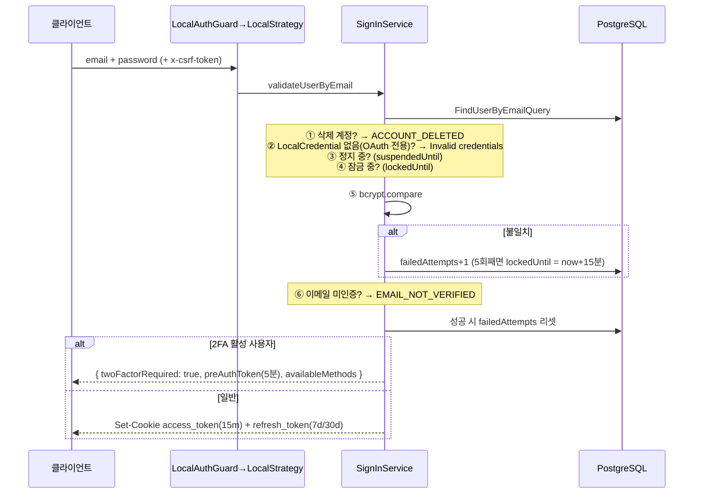
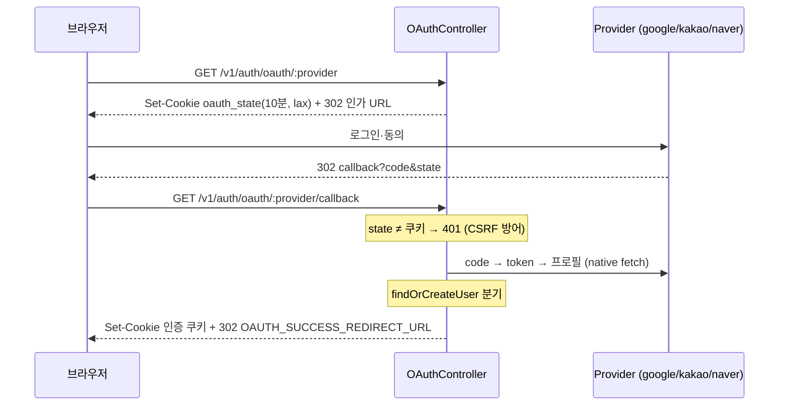

# 03. 인증

> 로그인 요청 하나가 어떤 검증을 거쳐 쿠키가 되는지, refresh가 어떻게 회전하는지, 2FA·OAuth가 어디서 분기하는지.
> 코드 위치: `apps/core-backend/src/core/auth/` (+ 비밀번호/이메일 변경은 `core/user/`)

## 한눈에 보기 — 토큰과 쿠키

| 이름 | 정체 | 만료 | 저장/전달 |
|---|---|---|---|
| `access_token` | JWT (payload `{ sub: userId }`) | JWT 자체: `JWT_EXPIRES_IN`(기본 1h) / **쿠키: 15분** | HttpOnly 쿠키 |
| `refresh_token` | JWT 아님 — `randomUUID()` 문자열, DB `RefreshToken` 테이블 | rememberMe 30일 / 기본 7일 | HttpOnly 쿠키 + DB |
| preAuthToken | JWT (`type: 'pre-auth'`) — 2FA 진행용 | 5분 | 응답 body (쿠키 아님) |
| `oauth_state` | OAuth CSRF 방지 state | 10분 | HttpOnly 쿠키, sameSite lax |
| `csrf-token` (prod: `__Host-csrf-token`) | CSRF double-submit 쿠키 | — | HttpOnly 쿠키 |

쿠키 옵션: `httpOnly: true`, `secure: production`, `path: '/'` (인증 쿠키 2종은 sameSite 미지정). 비밀번호 해시는 전 구간 **bcrypt cost 10**입니다.

## 1. 로그인 — `POST /v1/auth/sign-in`



짚어둘 동작:

- **검증 순서가 곧 에러 메시지 순서**입니다 — 정지/잠금은 비밀번호 확인 *전에*, 이메일 미인증은 *후에* 검사합니다
- **계정 잠금**: 5회 실패 → 15분 잠금 (`LocalCredential.failedAttempts/lockedUntil`, `repositories/increment-failed-attempts.command.ts`). 카운터는 **성공 로그인 시에만 리셋**되므로, 잠금이 풀린 뒤 첫 실패로 즉시 재잠금될 수 있습니다
- **2FA 사용자**는 이 시점에 쿠키를 받지 않습니다 — 5분짜리 preAuthToken만 받고 §4로 이어집니다
- Rate limit: 60초 10회 (`@Throttle`)

## 2. JWT 검증 — 요청마다 일어나는 일

`JwtAuthGuard`가 전역 등록되어 있으므로([00장 §2](00-overview.md#②-가드--전역-3종)) 모든 요청이 이 경로를 지납니다:

- **토큰 추출 우선순위** (`strategy/jwt.strategy.ts`): ① 쿠키 `access_token` → ② `Authorization: Bearer`(Swagger용) → ③ 쿼리 `?token=`
- `validate()`는 `type: 'pre-auth'` 토큰을 거부하고(2FA 미완료 토큰으로 API 접근 불가), 사용자를 DB에서 재조회해 `req.user = { id, username, isLogin: true, userSetting }`을 만듭니다
- `@Public()` 라우트도 토큰이 있으면 소프트 검증해 `req.user`를 채웁니다 (실패해도 차단하지 않음)

## 3. Refresh 회전 — `POST /v1/auth/refresh`

1. 쿠키의 `refresh_token`으로 DB 조회 (`token @unique`) — 없거나 만료면 401 + 쿠키 정리
2. **기존 토큰 즉시 삭제** (회전) 
3. 새 refresh 토큰 발급 — **잔여 유효기간을 승계**합니다 (연장 아님, 최소 1일). "30일마다 갱신하면 영원히 로그인"이 아니라 rememberMe 기간이 상한
4. 새 access token + 쿠키 재설정

특성 (설계 판단 시 알아둘 것):

- 토큰은 DB에 **평문 저장**이며, 회전된(삭제된) 토큰의 재사용을 **탈취로 감지하는 로직은 없습니다** — 단순 401 처리
- `RefreshToken`에 `ipAddress`/`userAgent`가 기록되어 세션 관리 화면(§7)의 데이터가 됩니다 (단, OAuth 로그인 경로는 IP/UA 미기록)
- 프론트 ApiClient는 401을 받으면 이 엔드포인트로 1회 자동 재시도합니다 → [08장 §3](08-frontend.md#3-apiclient)

## 4. 2FA — TOTP + 이메일 OTP

상태는 모두 `LocalCredential`에 있습니다: `totpEnabled`/`totpSecret`, `emailOtpEnabled`. 진행 중 코드는 `TwoFactorChallenge`(codeHash — bcrypt, 만료 10분).

**설정** (로그인 상태에서):

- TOTP: `GET /2fa/totp/setup` → secret 생성 + QR data URL(otplib+qrcode, issuer "Weaver2") → `POST /2fa/totp/confirm`으로 코드 검증 후 활성화
- 이메일 OTP: `POST /2fa/email/setup` → 6자리 코드 발송 → `POST /2fa/email/confirm`

**로그인 시 인증** (`@Public`):

```
sign-in → preAuthToken 수령
  → (이메일 방식이면) POST /2fa/email/send  — preAuthToken 검증 후 코드 발송
  → POST /2fa/authenticate { preAuthToken, method, code }
  → 검증 성공 시 SignInService.login으로 정식 쿠키 발급
```

- **백업 코드(recovery code)는 없습니다.** 복구 수단은 "다른 2FA 방법"뿐이므로, **마지막 남은 2FA 수단은 비활성화할 수 없게** 막혀 있습니다 (`DELETE /2fa/totp`, `/2fa/email`)
- Rate limit이 촘촘합니다: authenticate 5회/60초, 이메일 발송·설정 3회/60초

## 5. OAuth — Google · Kakao · Naver

Passport를 쓰지 않는 native fetch 구현입니다 (CHARTER §5). Provider들은 `OAuthProvider` 인터페이스로 통일되어 `OAuthProviderRegistry`에 등록됩니다 (`oauth/oauth.module.ts`) — 새 provider 추가 = 구현체 하나 + 등록 한 줄.



`findOrCreateUser`의 3분기 (`oauth/oauth.service.ts`):

1. `(provider, providerId)`의 OAuthAccount 존재 → 기존 사용자 로그인
2. 없는데 **같은 이메일의 계정이 존재 → `ConflictException`** — 자동 연동하지 않습니다 (이메일만 알면 계정을 탈취할 수 있으므로). 프론트는 `?error=oauth_email_conflict`로 안내하고, 사용자는 로그인 후 설정에서 수동 연동합니다
3. 둘 다 없음 → 신규 가입 (username은 `{provider}_{providerId 앞 8자}` + 충돌 시 랜덤 suffix)

연동 관리: `GET /oauth/connections`, `DELETE /oauth/connections/:provider` — **LocalCredential 없는 OAuth 전용 계정은 마지막 연동을 해제할 수 없습니다** (로그인 수단이 사라지므로).

## 6. 회원가입·비밀번호·이메일 변경

| 플로우 | 토큰/코드 | 만료 | 비고 |
|---|---|---|---|
| 회원가입 이메일 인증 | 64자 hex (`randomBytes(32)`) → 링크 | 1시간 | 약관 동의 필수, 재발송은 열거 방지 위해 항상 동일 응답 |
| 비밀번호 재설정 (비로그인) | 64자 hex → 링크 | 1시간 | 유저 없어도 성공 응답 (열거 방지). **세션 무효화 없음** |
| 비밀번호 변경 (로그인) | 현재 비밀번호 확인 | — | **전체 세션 무효화** (`DeleteRefreshTokensByUserIdCommand`) |
| 이메일 변경 (로그인) | 6자리 코드 (bcrypt 해시 저장) → 새 이메일로 발송 | 10분 | 현재 비밀번호 확인 필수. 세션 무효화 없음 |

**변경(change)과 재설정(reset)의 세션 정책이 다르다**는 점을 기억하세요 — 재설정 경로는 기존 refresh 토큰을 지우지 않습니다.

## 7. 세션 관리 — `auth/sessions`

세션 = `RefreshToken` 레코드입니다:

- `GET /v1/auth/sessions` — 기기 목록 (`ipAddress`, `userAgent`, `createdAt`, `isCurrent` — 현재 쿠키와 매칭)
- `DELETE /v1/auth/sessions/:id` — 개별 로그아웃 (`userId` 조건 포함이라 타인 세션 삭제 불가)
- `DELETE /v1/auth/sessions/others` — 나머지 전부 로그아웃
- `POST /v1/auth/sign-out` — 현재 refresh 토큰 DB 삭제 + 쿠키 정리

## 8. CSRF

`csrf-csrf`(double-submit) 미들웨어가 전 요청에 적용됩니다 (`libs/common/src/global/middleware/security.middleware.ts`):

- `GET/HEAD/OPTIONS` 면제, 뮤테이션은 `x-csrf-token` 헤더 필수
- 토큰 발급: `GET /v1/auth/csrf-token` (`@Public`) — 프론트 ApiClient가 자동 발급·캐시·403 시 재발급합니다
- 세션 식별: `refresh_token` 쿠키 ?? IP
- Swagger 요청은 면제 (origin/referer 판별)
- 시크릿: `CSRF_SECRET ?? JWT_SECRET ?? fallback` — **운영에서는 `CSRF_SECRET`을 반드시 설정**하세요

## 9. Rate Limiting 요약

전역 60초/100회 + 민감 엔드포인트 오버라이드:

| 엔드포인트 | 60초당 |
|---|---|
| sign-in | 10 |
| 2fa/authenticate | 5 |
| 2fa/email/send·setup, verify/resend, password/request-reset, users/me/email | 3 |
| sign-up/email, password/reset, users/me/email/confirm | 5 |
| refresh | (전역 100만 적용) |

⚠️ **`NODE_ENV=development`에서는 `DevThrottlerGuard`가 모든 rate limit을 통과시킵니다** — 로컬에서 잠금·제한 동작을 테스트하려면 이 사실을 알아야 합니다. 통합 테스트가 `NODE_ENV=development`를 쓰는 이유이기도 합니다 ([09장](09-testing.md)).

## 10. 알아둘 트레이드오프 (사실 기반)

현재 구현이 의도적으로/단순화를 위해 택한 지점들입니다. 보안 요구가 높은 fork에서는 재검토 대상:

1. refresh 토큰·비밀번호 재설정 토큰·이메일 인증 토큰·TOTP secret은 **DB에 평문 저장** (코드 계열만 bcrypt 해시)
2. refresh 재사용 탈취 감지 없음 (회전만 수행)
3. 비밀번호 **재설정** 시 세션 무효화 없음 (변경 시에만)
4. 인증 쿠키 sameSite 미지정 (CSRF는 별도 토큰으로 방어)
5. access_token 쿠키 수명(15분)과 JWT 만료(기본 1h)가 불일치 — 실효 수명은 짧은 쪽(15분)
6. sign-in 응답 body에도 토큰이 평문 포함 (쿠키와 이중 전달)

## 더 보기

- 인증 데이터 모델: [02. 데이터 모델 §2.1](02-data-model.md#21-인증-authprisma)
- 전역 가드 체인: [00. 시스템 개요 §2](00-overview.md#2-백엔드-요청-수명주기)
- 프론트의 인증 처리(3중 방어): [08. 프론트엔드 §4](08-frontend.md#4-인증-상태--3중-방어)
- 보안 정책 전반: [`SECURITY.md`](../../SECURITY.md)
