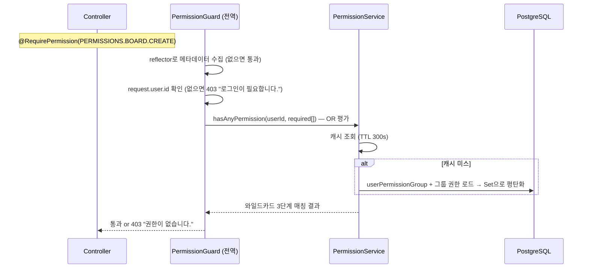

# 04. 권한 시스템

> weaver2는 역할(Role) 하나로 뭉뚱그리지 않고 **권한 그룹 + 권한 문자열** 기반으로 동작합니다 (AWS IAM 패턴, CHARTER §5).
> 이 장은 권한이 정의되는 곳, 검사되는 경로, 캐시되는 방식, 그리고 프론트엔드가 같은 규칙을 공유하는 방법을 다룹니다.

## 한눈에 보기

권한 체계는 **두 축**으로 구성되며, 서로 별개입니다:

| 축 | 질문 | 저장 위치 | 검사 지점 |
|---|---|---|---|
| **전역 권한** | "이 사용자가 `post:delete:all`을 할 수 있나?" | PermissionGroup → 권한 문자열 | `@RequirePermission()` + `PermissionGuard` (전역 가드) |
| **리소스 권한** | "이 사용자가 *이 게시판*에 글을 쓸 수 있나?" | ResourcePermission (리소스 인스턴스별 그룹 허용/거부) | `BoardPermissionService` 등 서비스 레이어 |

## 1. 권한 문자열과 PERMISSIONS 상수

권한은 enum이 아니라 문자열이며, 형식은 **`resource:action[:scope]`**입니다:

```
post:read          # 게시글 읽기
post:update:own    # 본인 게시글 수정
post:update:all    # 모든 게시글 수정
post:*             # post 리소스 전체 (와일드카드)
*:*                # 슈퍼 권한 (PERMISSIONS.SUPER)
```

정의는 [`libs/shared/src/index.ts`](../../libs/shared/src/index.ts)의 `PERMISSIONS` 상수 하나입니다 — **백엔드와 프론트엔드가 같은 파일을 import**하므로 권한 정의가 어긋날 수 없습니다. 도메인은 12종: POST, COMMENT, BOARD, USER, ADMIN, EMAIL, ANALYTICS, TERMS, PERMISSION_GROUP, UPLOAD, REPORT, MODERATION (+ SUPER).

> `libs/common/src/constants/permissions.const.ts`는 위를 re-export한 것 + 관리자 UI용 라벨 배열(`ALL_PERMISSIONS`)입니다. 백엔드 컨트롤러가 이 경로로 import하는 경우가 있지만 정의의 원천은 `@weaver2/shared`입니다.

### 와일드카드 매칭 알고리즘

백엔드(`PermissionService.hasPermission`)와 프론트(`hasPermission()` 순수 함수)가 동치인 3단계 검사를 수행합니다:

```
1. 보유 권한에 "*:*" 있음                      → 허용
2. 요구 권한의 리소스 세그먼트 + ":*" 보유      → 허용  (예: post:update:own 요구 시 post:* 보유)
3. 요구 권한 문자열과 정확히 일치               → 허용
그 외                                          → 거부
```

주의: 와일드카드는 **보유 측**에만 의미가 있습니다. `post:update:own`을 보유한 사용자에게 `post:*`를 요구하면 매칭되지 않습니다.

## 2. 데이터 모델

사용자에게 권한이 직접 붙지 않습니다 — 반드시 그룹을 경유합니다 ([`permissions.prisma`](../../apps/core-backend/prisma/schema/permissions.prisma)):

```
User ←(UserPermissionGroup)→ PermissionGroup ←(PermissionGroupPermission)— 권한 문자열
```

리소스 축은 별도 테이블: `ResourcePermission`(`@@unique([resourceType, resourceId, action])`) + `ResourcePermissionAllowedGroup` / `ResourcePermissionDeniedGroup` 조인.

## 3. 시드 그룹 6종

[`prisma/seed/permission-group.seed.ts`](../../apps/core-backend/prisma/seed/permission-group.seed.ts)가 심는 시스템 그룹(`isSystem: true`). 시드가 권한 구성의 소스 오브 트루스이며, 재실행 시 목표 집합과 diff를 계산해 동기화합니다:

| 그룹 | 요지 | 특징적인 권한 |
|---|---|---|
| SuperAdmin | 전부 | `*:*` 단 하나 |
| Admin | 관리 전권 (유저 삭제 제외) | `admin:*`, `post:*`, `board:*`, `user:suspend`, `report:*`, `moderation:*` … |
| Operator | 운영 — 콘텐츠 전체 관리 + 정지 | `post:delete:all`, `user:suspend`, `report:*`, `moderation:*` |
| Moderator | 모더레이션 — 숨김·경고까지만 | `moderation:content:hide`, `moderation:user:warn` (삭제·정지 없음) |
| User | 일반 회원 | `post:create`, `post:update:own`, `comment:*:own` 계열, `report:create` |
| Suspended | 정지 계정 | 권한 없음 `[]` |

Moderator ⊂ Operator ⊂ Admin의 계단 구조가 신고 처리 권한 분리(숨김·경고 / 삭제·정지 / 전체)의 근거입니다 → [07장 신고](07-board-reference.md).

## 4. 전역 권한 검사 경로 (가드 체인)



- `@RequirePermission(perm | perm[])` — [`core/permission/decorators/require-permission.decorator.ts`](../../apps/core-backend/src/core/permission/decorators/require-permission.decorator.ts). **배열은 OR**입니다 (하나라도 있으면 통과)
- `PermissionGuard` — [`core/permission/guards/permission.guard.ts`](../../apps/core-backend/src/core/permission/guards/permission.guard.ts). `auth.module.ts`에서 `APP_GUARD`로 **전역 등록**되어 있으므로, 컨트롤러에 `@UseGuards(PermissionGuard)`를 붙이지 않아도 `@RequirePermission`은 동작합니다 (일부 컨트롤러의 명시적 `@UseGuards`는 중복이지만 무해)
- 데코레이터가 없는 라우트는 권한 검사 없이 통과 — 인증 여부는 별도로 `JwtAuthGuard`가 결정

## 5. PermissionService 캐시

사용자별 권한 Set은 인메모리 LRU 캐시에 올라갑니다 ([`core/permission/services/permission.service.ts`](../../apps/core-backend/src/core/permission/services/permission.service.ts)):

| 항목 | 값 | env |
|---|---|---|
| 전략 | `memory`(기본) / `none`(매번 DB) | `PERMISSION_CACHE_STRATEGY` |
| TTL | 300초 | `PERMISSION_CACHE_TTL` |
| 최대 크기 | 1000 사용자 (초과 시 가장 오래된 항목 제거) | `PERMISSION_CACHE_MAX_SIZE` |

**무효화 시점** — 관리자 API(`system/admin/api/services/admin-permission.api.service.ts`)의 쓰기 경로에 연결되어 있습니다:

- 그룹의 권한 변경 → 그 그룹 소속 사용자 전원 무효화
- 사용자의 그룹 할당/해제 → 해당 사용자 무효화

> **주의**: 관리자 API를 거치지 않고 권한을 바꾸면(예: DB 직접 수정, 시드 재실행) 캐시가 최대 TTL(5분)까지 낡은 값을 반환합니다. 즉시 반영이 필요하면 `invalidateAllCache()`를 호출하거나 재시작하세요.

## 6. 리소스 권한 (ResourcePermission)

게시판처럼 **인스턴스별로 접근 규칙이 다른** 리소스를 위한 ACL입니다. 판정은 `PermissionService.hasResourcePermission(userId | null, resourceType, resourceId, action)`:

```
1. (resourceType, resourceId, action) 규칙 조회 — 없으면 기본 거부
2. 비로그인 사용자 → rule.allowAnonymous 값 반환
3. deniedGroups에 사용자의 그룹이 있으면 → 거부 (거부가 허용보다 우선)
4. allowedGroups가 비어 있으면 → 로그인만으로 허용
5. 사용자의 그룹이 allowedGroups에 있으면 → 허용
```

게시판 도메인은 이를 [`features/board/services/board-permission.service.ts`](../../apps/core-backend/src/features/board/services/board-permission.service.ts)로 감쌉니다 — `BoardActionType`(read/write/edit_own/edit_all/delete_own/delete_all/comment)을 넘기고, own/all 분기는 `authorId === user.id` 비교로 처리합니다. 시드는 게시판 성격별 프리셋 3종을 사용합니다: 공개(Free), 회원 전용(Q&A), 공지(Notice — 쓰기는 Admin만).

전역 권한과의 관계: **둘은 AND가 아니라 용도가 다릅니다.** `@RequirePermission`은 "기능 자체를 쓸 자격", ResourcePermission은 "이 인스턴스에 대한 접근". 예컨대 글쓰기는 게시판별 ResourcePermission으로 판정하고, 게시판 생성 같은 관리 작업은 `PERMISSIONS.BOARD.CREATE`로 판정합니다.

## 7. 프론트엔드에서의 권한

프론트는 **같은 `hasPermission()` 함수를 import**해서 UI 노출을 제어합니다. 전용 훅은 없고, `useMe()`가 내려주는 `user.permissions: string[]`(와일드카드 포함 원본 문자열)을 그대로 넘깁니다:

```tsx
// 사이드바 메뉴 필터링 — shared/components/layout/admin-sidebar.tsx
NAV_ITEMS.filter(({ permission }) => hasPermission(userPermissions, permission))

// 섹션 가드 — shared/components/auth/require-permission.tsx
<RequirePermission permission={PERMISSIONS.USER.READ}>...</RequirePermission>
// 배열이면 OR 평가, 미충족 시 fallback UI
```

- `user.permissions`는 `GET /v1/users/me` 응답에만 포함됩니다 (`core/user/dto/user.dto.ts`) — 다른 사용자 조회로는 권한이 내려오지 않습니다
- 관리자 영역 진입은 `app/(admin)/layout.tsx`가 `PERMISSIONS.ADMIN.ACCESS`로 검사하고, 세부 화면·버튼은 `RequirePermission`/개별 `hasPermission` 호출로 좁힙니다
- **프론트 검사는 UX용입니다.** 실제 강제는 항상 백엔드 가드와 ResourcePermission이 담당합니다

## 8. 관리자 권한 관리 API

`admin/permissions` 경로 ([`system/admin/api/controllers/admin-permission.api.controller.ts`](../../apps/core-backend/src/system/admin/api/controllers/admin-permission.api.controller.ts)):

- 그룹 CRUD (`PERMISSION_GROUP.READ/CREATE/UPDATE/DELETE` — 시스템 그룹은 삭제 불가)
- 그룹 권한 전체 교체 / 부분 제거 (`PERMISSION_GROUP.UPDATE`)
- 사용자 그룹 할당/해제 (`PERMISSION_GROUP.ASSIGN_USER`)
- 리소스 규칙 조회/교체/삭제 — 이쪽만 **`BOARD.MANAGE`** 권한으로 보호 (게시판 ACL 관리이므로)

## 새 권한을 추가하려면

1. `libs/shared/src/index.ts`의 `PERMISSIONS`에 상수 추가
2. 관리자 UI 라벨이 필요하면 `libs/common/src/constants/permissions.const.ts`의 `ALL_PERMISSIONS`에도 추가
3. `prisma/seed/permission-group.seed.ts`에서 어떤 그룹이 이 권한을 갖는지 지정
4. 컨트롤러에 `@RequirePermission(PERMISSIONS.<도메인>.<액션>)` 부착
5. 프론트에서 UI 노출 제어가 필요하면 `hasPermission` / `RequirePermission` 사용

→ 전체 절차는 [10. 새 기능 만들기](10-new-feature.md)에 통합되어 있습니다.

## 더 보기

- 권한 데이터 모델: [02. 데이터 모델 §2.3](02-data-model.md#23-권한-permissionsprisma)
- 게시판 권한 실사용: [07. 게시판 (레퍼런스 도메인)](07-board-reference.md)
- 설계 배경: [`docs/audits/weaver2-permission-plan-2026-02-05.md`](../audits/weaver2-permission-plan-2026-02-05.md)
