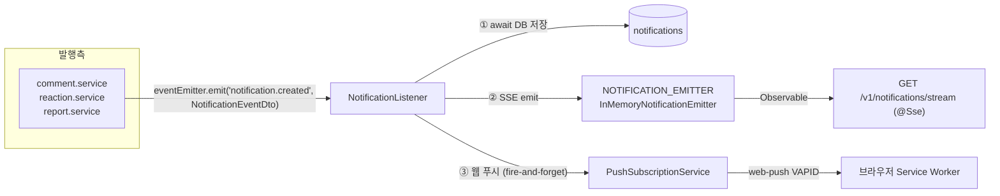

# 05. 알림

> 댓글이 달리면 어떻게 상대의 브라우저까지 도달하는가 — 이벤트 발행부터 DB 저장, SSE, 웹 푸시까지의 전체 파이프라인.
> 코드 위치: `apps/core-backend/src/core/notification/`

## 파이프라인 전체 그림



## 1. 발행 — 도메인 서비스가 이벤트를 던진다

이벤트는 **`'notification.created'` 단일 종류**이며, 페이로드는 `NotificationEventDto`(`dto/notification-event.dto.ts`)입니다:

```ts
{ recipientId, actorId, type: NotificationType, title, body, link? }
```

발행 지점 전수 (5곳):

| 트리거 | type | 수신자 | 위치 |
|---|---|---|---|
| 답글 생성 (`parentId` 있음) | REPLY | 부모 댓글 작성자 | `features/board/services/comment.service.ts` |
| 댓글 생성 | COMMENT | 게시글 작성자 | 〃 |
| 리액션 추가 | REACTION | 게시글 작성자 | `features/board/services/reaction.service.ts` |
| 신고 처리/기각 | SYSTEM | 신고자 | `features/report/services/report.service.ts` (2곳) |

관례:

- `link`는 `/boards/${boardId}/posts/${postId}` 형태 (신고 알림은 link 없음)
- `body`는 댓글 본문을 100자로 절단해 담음
- **자기 알림 차단은 발행측이 아니라 리스너 책임** — 발행은 조건 없이 하고, 리스너가 `recipientId === actorId`면 버립니다

새 도메인에서 알림을 추가하려면 이 패턴 그대로: `EventEmitter2`를 주입받아 `emit('notification.created', dto)` 한 줄이면 저장·SSE·푸시가 모두 따라옵니다.

## 2. 리스너 — 순서와 실패 격리

`NotificationListener`(`listeners/notification.listener.ts`, `@OnEvent('notification.created')`)의 처리 순서:

1. **자기 알림 차단** — `recipientId === actorId`면 즉시 return
2. **DB 저장** — `await` (여기서 알림 id가 생김)
3. **SSE 발송** — 저장된 DTO를 emitter로 (동기, 구독자 없으면 no-op)
4. **웹 푸시** — `void`로 fire-and-forget (await하지 않음)

실패 정책: 전체가 하나의 try/catch입니다. **DB 저장이 실패하면 SSE·푸시도 나가지 않습니다** (로그만 남김) — "저장 안 된 알림은 전달하지 않는다"가 불변식입니다. 웹 푸시 내부 실패는 리스너에 전파되지 않고 푸시 서비스가 자체 처리합니다(§4).

## 3. SSE — 실시간 전달

### NOTIFICATION_EMITTER 추상화 (확장 포인트)

- 토큰: `Symbol('NOTIFICATION_EMITTER')`, 인터페이스 `INotificationEmitter { emit, subscribe, cleanup }` (`emitters/notification-emitter.interface.ts`)
- 기본 구현 `InMemoryNotificationEmitter`: 사용자별 rxjs `Subject`를 `Map`으로 관리
- 바인딩: `notification.module.ts`의 `{ provide: NOTIFICATION_EMITTER, useClass: InMemoryNotificationEmitter }`

**Redis로 교체하려면** 이 `useClass` 한 줄을 Redis 구현체로 바꾸면 됩니다 (CHARTER §6 확장 포인트). 언제 바꿔야 하나: **백엔드를 다중 인스턴스로 스케일아웃할 때.** 인메모리 emitter는 SSE 연결을 받은 노드와 이벤트를 발행한 노드가 같다는 전제라서, 인스턴스가 2개만 되어도 알림이 유실됩니다. Redis 구현체는 현재 저장소에 없습니다(자리만 열려 있음 — pull, not push).

### 스트림 엔드포인트

`GET /v1/notifications/stream` — NestJS `@Sse()`로 `subscribe(userId)` Observable을 반환합니다 (`controllers/notification.controller.ts`). 연결 종료 시 `req.on('close')` + rxjs `finalize` 이중으로 `cleanup(userId)`을 호출해 Subject를 정리합니다. heartbeat/keepalive는 없습니다 — 프록시 뒤에 배포할 때 idle timeout 설정에 유의하세요.

### 프론트 수신

`apps/core-frontend/src/core/notification/hooks/use-notification-stream.ts` — `EventSource(..., { withCredentials: true })`로 연결하고(인증은 쿠키), 이벤트 수신 시 React Query 캐시를 조작합니다: `unreadCount` +1, 알림 목록 invalidate. `(protected)/layout.tsx`가 인증된 사용자에게만 연결합니다. 재연결은 EventSource의 자동 재연결에 의존합니다.

## 4. 웹 푸시 — 브라우저가 닫혀 있어도

`services/push-subscription.service.ts`:

- **VAPID 키** — `VAPID_PUBLIC_KEY`/`VAPID_PRIVATE_KEY` env. **없으면 앱은 정상 기동하고 푸시만 조용히 비활성화**됩니다(`pushEnabled=false`, warn 로그). "푸시가 안 나가요"의 1순위 확인 지점
- **구독 저장** — `PushSubscription` 모델(endpoint unique), `endpoint` 기준 upsert. 저장/해제 API: `POST`/`DELETE /v1/notifications/push-subscription`
- **발송** — 사용자의 모든 구독에 `Promise.allSettled` 병렬 발송. **410/404 응답은 만료 구독으로 판단해 자동 삭제**
- **프론트 등록 흐름** — `use-push-subscription.ts`: 권한 요청 → `serviceWorker.register('/sw.js')` → 공개키 조회(`GET .../push-subscription/public-key`) → `pushManager.subscribe` → 백엔드 저장
- **Service Worker** — `apps/core-frontend/public/sw.js`: `push` 이벤트로 `showNotification`, 클릭 시 `data.link`로 창 포커스/열기

## 5. 알림 목록·읽음 API

| 엔드포인트 | 구현 요점 |
|---|---|
| `GET /v1/notifications` | keyset 스타일 무한스크롤 — `limit+1`개 조회로 `hasNextPage` 판정, `createdAt desc, id desc` |
| `GET /v1/notifications/unread-count` | `count({ userId, isRead: false })` — `@@index([userId, isRead, createdAt desc])`가 뒷받침 |
| `PATCH /v1/notifications/:id/read` | `updateMany`로 소유자 검증 겸용 (`where: { id, userId }`, 0건이면 404) |
| `PATCH /v1/notifications/read-all` | 미읽음 일괄 갱신 |

## 트러블슈팅 지도

| 증상 | 확인 순서 |
|---|---|
| 알림이 아예 안 옴 | 발행측 가드(작성자 없음?) → 자기 알림인지 → 리스너 에러 로그(DB 저장 실패 시 전부 중단) |
| 목록엔 쌓이는데 실시간이 안 옴 | SSE 연결 여부(브라우저 Network 탭 stream) → 다중 인스턴스 환경인지(인메모리 emitter 한계) |
| 푸시만 안 옴 | VAPID env 유무(warn 로그) → 브라우저 알림 권한 → 구독이 410/404로 삭제됐는지 |

## 더 보기

- 알림 데이터 모델: [02. 데이터 모델 §2.4](02-data-model.md#24-알림-notificationprisma)
- 발행측 코드: [07. 게시판 §5 리액션](07-board-reference.md#5-리액션--unique-제약--raw-집계)
- 확장 포인트 목록: [`CHARTER.md`](../../CHARTER.md) §6
