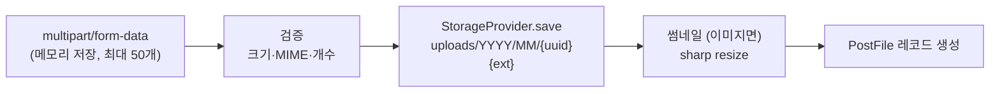

# 06. 파일 업로드

> 파일이 올라와서 저장되고, 썸네일이 만들어지고, 다시 서빙되기까지 — 그리고 Local↔S3 전환이 어떻게 한 줄로 가능한지.
> 코드 위치: `libs/upload/`(코어) + `apps/core-backend/src/infrastructure/upload/`(컨트롤러)

## 1. StorageProvider 추상화 — 확장 포인트의 교과서

저장 백엔드는 인터페이스 뒤에 숨어 있습니다 (`libs/upload/src/providers/storage-provider.interface.ts`):

```ts
interface StorageProvider {
  save(file, dir): { storedName, path }
  saveBuffer(buffer, filename, dir): { storedName, path }
  delete(path); exists(path);
  getFileUrl(path): Promise<string>
}
```

구현 2종과 분기 지점:

| 구현 | 저장 | `getFileUrl` 반환 |
|---|---|---|
| `LocalStorageProvider` | `uploads/YYYY/MM/{uuid}{ext}` 파일시스템 | `/uploads/...` 정적 경로 |
| `S3StorageProvider` | S3/MinIO (`S3_ENDPOINT` 있으면 `forcePathStyle` — MinIO 호환) | **presigned GET URL (1시간 만료)** |

분기는 `libs/upload/src/upload.module.ts`의 provider factory 한 곳: `STORAGE_DRIVER` env가 `s3`면 S3, 아니면 local. **서비스·컨트롤러 코드는 드라이버를 전혀 모릅니다** — CHARTER §5.1 "seam은 열되 구현은 필요한 것만"의 대표 사례입니다.

S3 필수 env: `S3_REGION`, `S3_ACCESS_KEY_ID`, `S3_SECRET_ACCESS_KEY`, `S3_BUCKET` (+선택 `S3_ENDPOINT`).

## 2. 업로드 플로우

`POST /v1/upload` (`infrastructure/upload/controllers/upload.controller.ts`):



1. **수신** — `FilesInterceptor('files', 50, { storage: memoryStorage() })`. Rate limit 1분 10회
2. **검증** — 값은 코드 하드코딩이 아니라 **SystemSetting(런타임 설정)**에서 옵니다 (`infrastructure/config/system-setting.service.ts`의 DEFAULTS):

   | 설정 키 | 기본값 |
   |---|---|
   | `uploadMaxFileCount` | 10 |
   | `uploadMaxFileSize` | 10 MiB |
   | `uploadAllowedMimeTypes` | jpeg, png, gif, webp, pdf, zip |
   | `uploadThumbnailWidth/Height` | 300×300 |
   | `uploadOrphanRetentionHours` | null (고아 정리 비활성) |

   관리자 화면의 시스템 설정에서 재시작 없이 변경할 수 있습니다.
3. **저장** — 파일명은 provider가 `randomUUID() + 확장자`로 생성. 원본 이름은 DB에 별도 보관
4. **썸네일** — 이미지 MIME(jpeg/png/gif/webp)이면 업로드 처리 중 **동기적으로** `sharp().resize(w, h, { fit: 'inside', withoutEnlargement: true })` 실행, `thumbnailPath`에 기록 (`libs/upload/src/services/thumbnail.service.ts`). 쿼리 파라미터 `generateThumbnail=false`로 끌 수 있음
5. **DB 기록** — 모델은 `PostFile` 하나입니다 (별도 Upload/Media 모델 없음, [02장 §2.2](02-data-model.md#22-게시판-boardprisma--레퍼런스-도메인)). 업로드 시 `postId`를 주면 즉시 게시글에 연결됩니다

## 3. 서빙 — 302 redirect

`GET /v1/upload/:id/file`, `GET /v1/upload/:id/thumbnail`은 파일을 직접 스트리밍하지 않고 **`getFileUrl` 결과로 302 redirect**합니다:

- **local** → `/uploads/YYYY/MM/uuid.ext` — `main.ts`의 `useStaticAssets(uploads/, { prefix: '/uploads' })`가 서빙. 프론트에서는 Next.js rewrites가 `/uploads/*`도 백엔드로 프록시합니다
- **s3** → presigned URL (1시간 만료) — 앱 서버를 거치지 않고 S3에서 직접 다운로드

이 구조 덕에 드라이버가 바뀌어도 클라이언트가 아는 URL(`/v1/upload/:id/file`)은 불변입니다. 메타 조회는 `GET /v1/upload/:id`(FileDto에 url/thumbnailUrl 포함), 게시글별 파일 목록 `GET /v1/upload/post/:postId`는 `@Public()`입니다.

## 4. 수명주기 — 연결, 삭제, 고아 정리

| 동작 | API | 규칙 |
|---|---|---|
| 게시글 연결/해제 | `PATCH /v1/upload/:id/link` / `unlink` | **본인 파일만** (`uploadedById` 검사) |
| 사용자 삭제 | `DELETE /v1/upload/:id` | 소프트 삭제 (`deletedAt`) |
| 관리자 삭제 | `DELETE (admin)` | 물리 삭제 — 스토리지 파일+썸네일 제거 후 hard delete |

**고아 파일 정리**: `postId`가 없는 채로 오래된 파일(작성 중 이탈 등)은 `UploadService.purgeOrphanedFiles(retentionHours)`가 스토리지+DB에서 물리 삭제합니다. 스케줄러는 `ContentPurgeScheduler`(매시 정각)가 겸하며, **`uploadOrphanRetentionHours` 설정이 null(기본)이면 동작하지 않습니다** — 운영에서 켜려면 시스템 설정에서 값을 지정하세요.

또 하나의 안전망: `PostFile.postId`는 `onDelete: SetNull`이라 게시글이 하드 삭제돼도 파일 레코드는 고아로 남고, 위 정리 경로가 회수합니다.

## 트러블슈팅 지도

| 증상 | 확인 |
|---|---|
| 업로드 415/400 | SystemSetting의 MIME/크기 제한 (기본 6종, 10MiB) |
| 이미지인데 썸네일 없음 | MIME이 4종(jpeg/png/gif/webp)에 드는지, `generateThumbnail` 파라미터 |
| S3 전환 후 404 | presigned URL 만료(1시간) 캐싱 여부, S3 env 4종 |
| 디스크가 참 | 고아 정리 활성화 여부 (`uploadOrphanRetentionHours`) |

## 더 보기

- 확장 포인트 목록: [`CHARTER.md`](../../CHARTER.md) §6
- 파일 모델: [02. 데이터 모델](02-data-model.md)
- 게시글 첨부 흐름: [07. 게시판 (레퍼런스 도메인)](07-board-reference.md)
